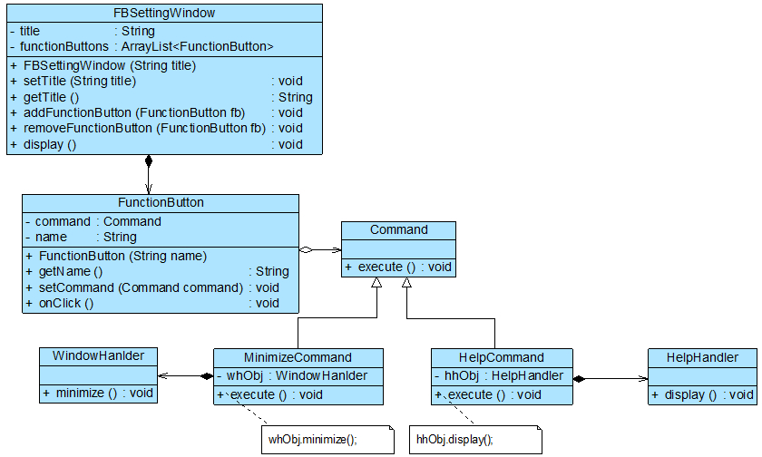

## 3 完整解决方案  
为了降低功能键与功能处理类之间的耦合度，让用户可以自定义每一个功能键的功能，Sunny 软件公司开发人员使用命令模式来设计“自定义功能键”模块，其核心结构如图 4 所示：  

  

在图 4 中，FBSettingWindow 是“功能键设置”界面类，FunctionButton 充当请求调用者，Command 充当抽象命令类，MinimizeCommand 和 HelpCommand 充当具体命令类，WindowHanlder 和 HelpHandler 充当请求接收者。完整代码如下所示：  

```
import java.util.*;

//功能键设置窗口类
class FBSettingWindow {
	private String title; //窗口标题
    //定义一个ArrayList来存储所有功能键
	private ArrayList<FunctionButton> functionButtons = new ArrayList<FunctionButton>();
	
	public FBSettingWindow(String title) {
		this.title = title;
	}
	
	public void setTitle(String title) {
		this.title = title;
	}
	
	public String getTitle() {
		return this.title;
	}
	
	public void addFunctionButton(FunctionButton fb) {
		functionButtons.add(fb);
	}
	
	public void removeFunctionButton(FunctionButton fb) {
		functionButtons.remove(fb);
	}
	
    //显示窗口及功能键
	public void display() {
		System.out.println("显示窗口：" + this.title);
		System.out.println("显示功能键：");
		for (Object obj : functionButtons) {
			System.out.println(((FunctionButton)obj).getName());
		}
		System.out.println("------------------------------");
	}	
}

//功能键类：请求发送者
class FunctionButton {
	private String name; //功能键名称
	private Command command; //维持一个抽象命令对象的引用
	
	public FunctionButton(String name) {
		this.name = name;
	}
	
	public String getName() {
		return this.name;
	}
	
    //为功能键注入命令
	public void setCommand(Command command) {
		this.command = command;
	}
	
    //发送请求的方法
	public void onClick() {
		System.out.print("点击功能键：");
		command.execute();
	}
}

//抽象命令类
abstract class Command {
	public abstract void execute();
}

//帮助命令类：具体命令类
class HelpCommand extends Command {
	private HelpHandler hhObj; //维持对请求接收者的引用
	
	public HelpCommand() {
		hhObj = new HelpHandler();
	}
	
    //命令执行方法，将调用请求接收者的业务方法
	public void execute() {
		hhObj.display();
	}
}

//最小化命令类：具体命令类
class MinimizeCommand extends Command {
	private WindowHanlder whObj; //维持对请求接收者的引用
	
	public MinimizeCommand() {
		whObj = new WindowHanlder();
	}
	
//命令执行方法，将调用请求接收者的业务方法
	public void execute() {
		whObj.minimize();
	}
}

//窗口处理类：请求接收者
class WindowHanlder {
	public void minimize() {
		System.out.println("将窗口最小化至托盘！");
	}
}

//帮助文档处理类：请求接收者
class HelpHandler {
	public void display() {
		System.out.println("显示帮助文档！");
	}
}
```

配置文件 config.xml 中存储了具体建造者类的类名，代码如下所示：


```
<?xml version="1.0"?>
<config>
	<className>HelpCommand</className>
    <className>MinimizeCommand</className>
</config>

```
编写如下客户端测试代码：  

```
class Client {
	public static void main(String args[]) {
		FBSettingWindow fbsw = new FBSettingWindow("功能键设置");
			
		FunctionButton fb1,fb2;
		fb1 = new FunctionButton("功能键1");
		fb2 = new FunctionButton("功能键1");
		
		Command command1,command2;
        //通过读取配置文件和反射生成具体命令对象
		command1 = (Command)XMLUtil.getBean(0);
		command2 = (Command)XMLUtil.getBean(1);
	    
        //将命令对象注入功能键
		fb1.setCommand(command1);
		fb2.setCommand(command2);
		
		fbsw.addFunctionButton(fb1);
		fbsw.addFunctionButton(fb2);
		fbsw.display();
		
        //调用功能键的业务方法
		fb1.onClick();
		fb2.onClick();
	}
}
```
编译并运行程序，输出结果如下：  

```
显示窗口：功能键设置
显示功能键：
功能键1
功能键1
------------------------------
点击功能键：显示帮助文档！
点击功能键：将窗口最小化至托盘！
```

如果需要修改功能键的功能，例如某个功能键可以实现“自动截屏”，只需要对应增加一个新的具体命令类，在该命令类与屏幕处理者（ScreenHandler）之间创建一个关联关系，然后将该具体命令类的对象通过配置文件注入到某个功能键即可，原有代码无须修改，符合“开闭原则”。在此过程中，**每一个具体命令类对应一个请求的处理者（接收者），通过向请求发送者注入不同的具体命令对象可以使得相同的发送者对应不同的接收者，从而实现“将一个请求封装为一个对象，用不同的请求对客户进行参数化”**，客户端只需要将具体命令对象作为参数注入请求发送者，无须直接操作请求的接收者。