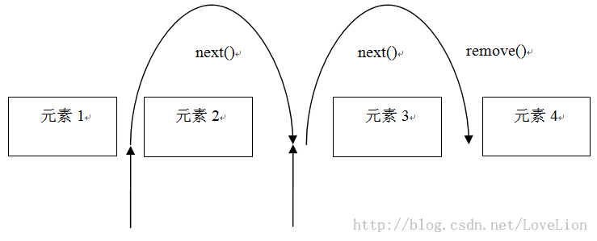
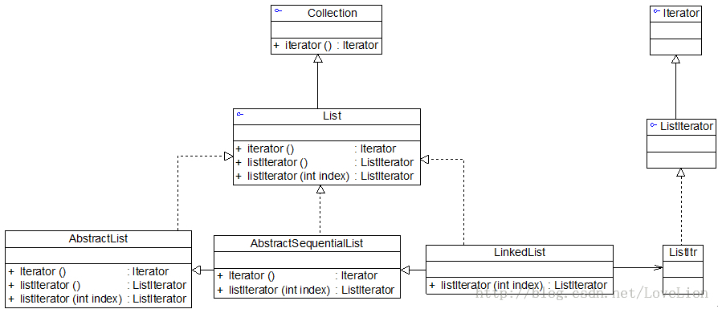

# 遍历聚合对象中的元素——迭代器模式（五）

## JDK内置迭代器  

为了让开发人员能够更加方便地操作聚合对象，在 Java、C# 等编程语言中都提供了内置迭代器。在Java集合框架中，常用的 List 和 Set 等聚合类都继承（或实现）了 java.util.Collection 接口，在Collection 接口中声明了如下方法（部分）：

```
package java.util;

public interface Collection<E> extends Iterable<E> {
    ……
boolean add(Object c);
boolean addAll(Collection c);
boolean remove(Object o);
boolean removeAll(Collection c);
boolean remainAll(Collection c); 
Iterator iterator();
……
}
```
除了包含一些增加元素和删除元素的方法外，还提供了一个 iterator() 方法，用于返回一个 Iterator 迭代器对象，以便遍历聚合中的元素；具体的 Java 聚合类可以通过实现该 iterator() 方法返回一个具体的 Iterator 对象。  

JDK 中定义了抽象迭代器接口 Iterator，代码如下所示

```
package java.util;

public interface Iterator<E> {
boolean hasNext();
E next();
void remove();
}
```

其中，hasNext() 用于判断聚合对象中是否还存在下一个元素，为了不抛出异常，在每次调用 next() 之前需先调用 hasNext()，如果有可供访问的元素，则返回 true；next() 方法用于将游标移至下一个元素，通过它可以逐个访问聚合中的元素，它返回游标所越过的那个元素的引用；remove() 方法用于删除上次调用 next() 时所返回的元素。  

Java 迭代器工作原理如图5所示，在第一个 next() 方法被调用时，迭代器游标由“元素1”与“元素2”之间移至“元素2”与“元素3”之间，跨越了“元素2”，因此 next() 方法将返回对“元素2”的引用；在第二个 next() 方法被调用时，迭代器由“元素2”与“元素3”之间移至“元素3”和“元素4”之间，next() 方法将返回对“元素3”的引用，如果此时调用 remove() 方法，即可将“元素3”删除。

  

如下代码片段可用于删除聚合对象中的第一个元素：

```
Iterator iterator = collection.iterator();   //collection是已实例化的聚合对象
iterator.next();	 	// 跳过第一个元素
iterator.remove(); 	// 删除第一个元素
```

需要注意的是，在这里，next() 方法与 remove() 方法的调用是相互关联的。如果调用 remove() 之前，没有先对 next() 进行调用，那么将会抛出一个 IllegalStateException 异常，因为没有任何可供删除的元素。  

如下代码片段可用于删除两个相邻的元素：

```
iterator.remove();
iterator.next();  //如果删除此行代码程序将抛异常
iterator.remove();  
```

在上面的代码片段中如果将代码 iterator.next();去掉则程序运行抛异常，因为第二次删除时将找不到可供删除的元素。  

在 JDK 中，Collection 接口和 Iterator 接口充当了迭代器模式的抽象层，分别对应于抽象聚合类和抽象迭代器，而 Collection 接口的子类充当了具体聚合类，下面以 List 为例加以说明，图列出了 JDK 中部分与 List 有关的类及它们之间的关系：

  

在 JDK 中，实际情况比图要复杂很多，在图中，List 接口除了继承 Collection 接口的 iterator() 方法外，还增加了新的工厂方法 listIterator()，专门用于创建 ListIterator 类型的迭代器，在 List 的子类 LinkedList 中实现了该方法，可用于创建具体的 ListIterator 子类 ListItr 的对象，代码如下所示：  

```
public ListIterator<E> listIterator(int index) {
return new ListItr(index);
}
```  

listIterator() 方法用于返回具体迭代器 ListItr 类型的对象。在 JDK 源码中，AbstractList 中的 iterator() 方法调用了 listIterator() 方法，如下代码所示：
```
public Iterator<E> iterator() {
    return listIterator();
}
```

客户端通过调用 LinkedList 类的 iterator() 方法，即可得到一个专门用于遍历 LinkedList 的迭代器对象。  

大家可能会问？既然有了 iterator() 方法，为什么还要提供一个 listIterator() 方法呢？这两个方法的功能不会存在重复吗？干嘛要多此一举？  

由于在 Iterator 接口中定义的方法太少，只有三个，通过这三个方法只能实现正向遍历，而有时候我们需要对一个聚合对象进行逆向遍历等操作，因此在 JDK 的 ListIterator 接口中声明了用于逆向遍历的 hasPrevious() 和 previous() 等方法，如果客户端需要调用这两个方法来实现逆向遍历，就不能再使用 iterator() 方法来创建迭代器了，因为此时创建的迭代器对象是不具有这两个方法的。我们只能通过如下代码来创建 ListIterator 类型的迭代器对象：  

```
ListIterator i = c.listIterator();
```
正因为如此，在 JDK 的 List 接口中不得不增加对 listIterator() 方法的声明，该方法可以返回一个 ListIterator 类型的迭代器，ListIterator 迭代器具有更加强大的功能。  

**思考**  
为什么使用 iterator() 方法创建的迭代器无法实现逆向遍历？

在 Java 语言中，我们可以直接使用 JDK 内置的迭代器来遍历聚合对象中的元素，下面的代码演示了如何使用 Java 内置的迭代器：  
```
import java.util.*;

class IteratorDemo {
   public static void process(Collection c) {
   	  	Iterator i = c.iterator(); //创建迭代器对象
		
        //通过迭代器遍历聚合对象
		while(i.hasNext()) {
			System.out.println(i.next().toString());
		}
   }

	public static void main(String args[]) {
	    Collection persons;
persons = new ArrayList(); //创建一个ArrayList类型的聚合对象
		persons.add("张无忌");
		persons.add("小龙女");
		persons.add("令狐冲");
		persons.add("韦小宝");
		persons.add("袁紫衣");
		persons.add("小龙女");
		
		process(persons);
	}
}
```

在静态方法 process() 中使用迭代器 Iterator 对 Collection 对象进行处理，该代码运行结果如下：  

```
张无忌
小龙女
令狐冲
韦小宝
袁紫衣
小龙女
```
如果需要更换聚合类型，如将 List 改成 Set，则只需更换具体聚合类类名，如将上述代码中的 ArrayList 改为 HashSet，则输出结果如下：  

```
令狐冲
张无忌
韦小宝
小龙女
袁紫衣
```

在 HashSet 中合并了重复元素，并且元素以随机次序输出，其结果与使用 ArrayList 不相同。由此可见，通过使用迭代器模式，使得更换具体聚合类变得非常方便，而且还可以根据需要增加新的聚合类，新的聚合类只需要实现 Collection 接口，无须修改原有类库代码，符合“开闭原则”。  

**练习**  
在 Sunny 软件公司开发的某教务管理系统中，一个班级（Class in    School）包含多个学生（Student），使用 Java 内置迭代器实现对学生信息的遍历，要求按学生年龄由大到小的次序输出学生信息。