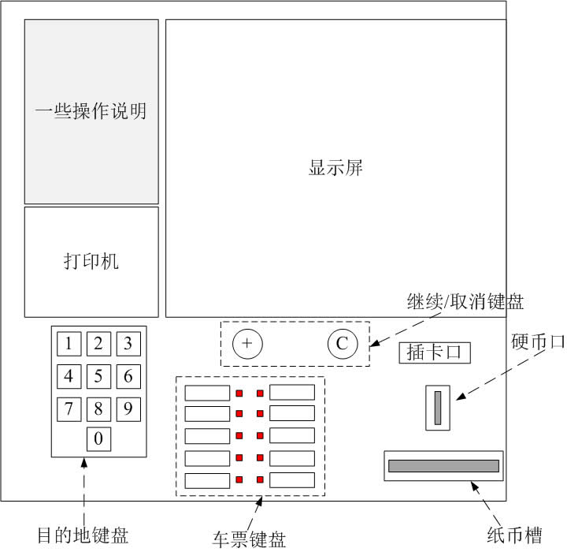
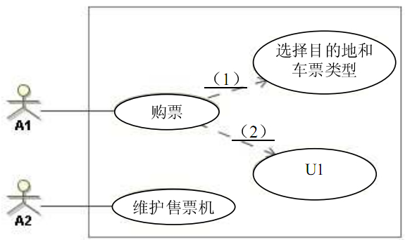

# 协调多个对象之间的交互——中介者模式（五）  

## 中介者模式总结  

中介者模式**将一个网状的系统结构变成一个以中介者对象为中心的星形结构**，在这个星型结构中，使用中介者对象与其他对象的一对多关系来取代原有对象之间的多对多关系。中介者模式在事件驱动类软件中应用较为广泛，特别是基于GUI（Graphical User Interface，图形用户界面）的应用软件，此外，在类与类之间存在错综复杂的关联关系的系统中，中介者模式都能得到较好的应用。  

**1. 主要优点**  

中介者模式的主要优点如下：  

(1) 中介者模式**简化了对象之间的交互**，它用中介者和同事的一对多交互代替了原来同事之间的多对多交互，一对多关系更容易理解、维护和扩展，将原本难以理解的网状结构转换成相对简单的星型结构。  

(2) 中介者模式**可将各同事对象解耦**。中介者有利于各同事之间的松耦合，我们可以独立的改变和复用每一个同事和中介者，增加新的中介者和新的同事类都比较方便，更好地符合“开闭原则”。  

(3) 可以**减少子类生成**，中介者将原本分布于多个对象间的行为集中在一起，改变这些行为只需生成新的中介者子类即可，这使各个同事类可被重用，无须对同事类进行扩展。  

**2. 主要缺点**  

中介者模式的主要缺点如下：  

在具体中介者类中包含了大量同事之间的交互细节，**可能会导致具体中介者类非常复杂**，使得系统难以维护。  

**3. 适用场景**  

在以下情况下可以考虑使用中介者模式：  

(1) 系统中**对象之间存在复杂的引用关系**，系统结构混乱且难以理解。  

(2) 一个对象由于引用了其他很多对象并且直接和这些对象通信，导致**难以复用该对象**。  

(3) 想**通过一个中间类来封装多个类中的行为，而又不想生成太多的子类**。可以通过引入中介者类来实现，在中介者中定义对象交互的公共行为，如果需要改变行为则可以增加新的具体中介者类。  

**练习**  
Sunny 软件公司欲开发一套图形界面类库。该类库需要包含若干预定义的窗格（Pane）对象，例如 TextPane、ListPane、GraphicPane 等，窗格之间不允许直接引用。基于该类库的应用由一个包含一组窗格的窗口（Window）组成，窗口需要协调窗格之间的行为。试采用中介者模式设计该系统。  

**2010年上半年 软件设计师 下午试卷 第三题**  

**【说明】**  

某运输公司决定为新的售票机开发车票销售的控制软件。图I给出了售票机的面板示意图以及相关的控制部件。

  

售票机相关部件的作用如下所述：  

(1) 目的地键盘用来输入行程目的地的代码（例如，200 表示总站）。  

(2) 乘客可以通过车票键盘选择车票种类（单程票、多次往返票和座席种类）。  

(3) 继续/取消键盘上的取消按钮用于取消购票过程，继续按钮允许乘客连续购买多张票。  

(4) 显示屏显示所有的系统输出和用户提示信息。  

(5) 插卡口接受 MCard（现金卡），硬币口和纸币槽接受现金。  

(6) 打印机用于输出车票。  

(7) 所有部件均可实现自检并恢复到初始状态。  

现采用面向对象方法开发该系统，使用 UML 进行建模，系统的顶层用例图和类图分别如图所示。

  

、(2)处所对应的关系。  

【问题2】  
根据说明中的描述，给出图中缺少的 C1-C4 所对应的类名以及(3)-(6)处所对应的多重度。  

【问题3】  
图III中的类图设计采用了中介者（Mediator）设计模式，请说明该模式的内涵。