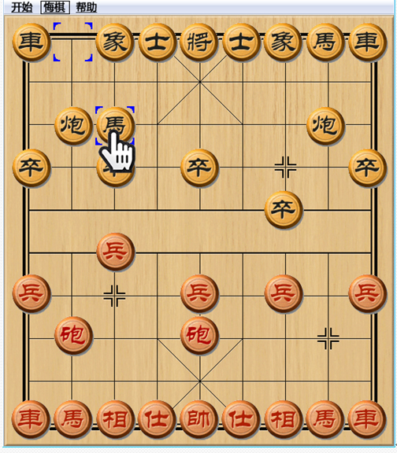
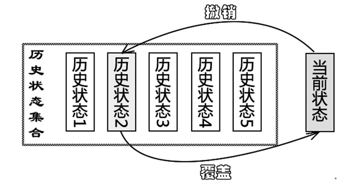

# 撤销功能的实现——备忘录模式（一）  

每个人都有过后悔的时候，但人生并无后悔药，有些错误一旦发生就无法再挽回，有些人一旦错过就不会再回来，有些话一旦说出口就不可能再收回，这就是人生。为了不后悔，凡事我们都需要三思而后行。说了这么多，大家可能已经晕了，不是在学设计模式吗？为什么弄出这么一堆人生感悟来，呵呵，别着急，本章将介绍一种让我们可以在软件中实现后悔机制的设计模式——备忘录模式，它是软件中的“后悔药”，是软件中的“月光宝盒”。话不多说，下面就让我们进入备忘录模式的学习。  
 
## 可悔棋的中国象棋  
 
Sunny 软件公司欲开发一款可以运行在 Android 平台的触摸式中国象棋软件，由于考虑到有些用户是“菜鸟”，经常不小心走错棋；还有些用户因为不习惯使用手指在手机屏幕上拖动棋子，常常出现操作失误，因此该中国象棋软件要提供“悔棋”功能，用户走错棋或操作失误后可恢复到前一个步骤。如图所示：  

 
 
如何实现“悔棋”功能是 Sunny 软件公司开发人员需要面对的一个重要问题，“悔棋”就是让系统恢复到某个历史状态，在很多软件中通常称之为“撤销”。下面我们来简单分析一下撤销功能的实现原理：  
 
在实现撤销时，首先必须保存软件系统的历史状态，当用户需要取消错误操作并且返回到某个历史状态时，可以取出事先保存的历史状态来覆盖当前状态。如图所示：  

  
 
备忘录模式正为解决此类撤销问题而诞生，它为我们的软件提供了“后悔药”，通过使用备忘录模式可以使系统恢复到某一特定的历史状态。
