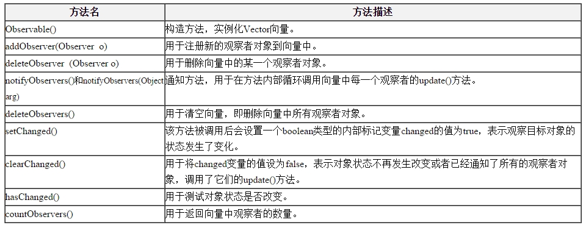

# 对象间的联动——观察者模式（四）  

## JDK对观察者模式的支持  

观察者模式在 Java 语言中的地位非常重要。在 JDK 的 java.util 包中，提供了 Observable 类以及 Observer 接口，它们构成了 JDK 对观察者模式的支持。如图所示：  

   

(1) Observer接口  

在 java.util.Observer 接口中只声明一个方法，它充当抽象观察者，其方法声明代码如下所示：
void  update(Observable o, Object arg);  

当观察目标的状态发生变化时，该方法将会被调用，在 Observer 的子类中将实现 update() 方法，即具体观察者可以根据需要具有不同的更新行为。当调用观察目标类 Observable 的 notifyObservers() 方法时，将执行观察者类中的 update() 方法。  

(2) Observable类  

java.util.Observable类充当观察目标类，在Observable中定义了一个向量Vector来存储观察者对象，它所包含的方法及说明见表：

  

我们可以直接使用 Observer 接口和 Observable 类来作为观察者模式的抽象层，再自定义具体观察者类和具体观察目标类，通过使用 JDK 中的 Observer 接口和 Observable 类，可以更加方便地在 Java 语言中应用观察者模式。  
